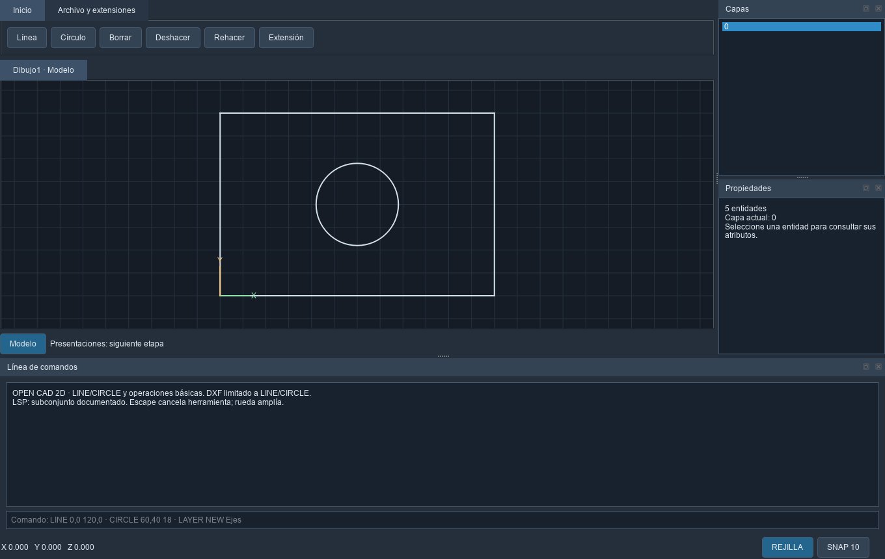

# OPEN CAD 2D

CAD 2D abierto, gratuito y orientado a trabajo profesional. Esta entrega es un
prototipo verificable; la paridad con AutoCAD es el objetivo del roadmap.
Fuente original GPL-3.0-or-later. No requiere licencia de AutoCAD.

La auditoría selecciona QCAD Community para el próximo spike C++/Qt6. El prototipo
actual usa Python/Qt6 y un modelo propio temporal: QCAD aún no está integrado.
LibreCAD 3 permanece como alternativa evaluada. [Auditoría](docs/AUDIT.md).



## Ejecutar y verificar

Con Python 3.12 y un entorno virtual:

```powershell
python -m venv .venv
.venv/Scripts/python -m pip install -e .
.venv/Scripts/python launch.py
.venv/Scripts/python .agents/skills/cad-regression-testing/scripts/regress.py --report build/regression.json
.venv/Scripts/python .agents/skills/cad-ui-reconstruction/scripts/check_ui.py --output build/smoke
```

Linux/macOS: usar `.venv/bin/python`. Las pruebas Qt usan offscreen. Los resultados
locales acreditan Windows; la [CI del commit 4ce542f](https://github.com/aavaladez/open-cad-2d/actions/runs/37987669951)
aprobó Windows, Linux, macOS y el portable Windows. `cmake -S . -B build/cmake` y `ctest --test-dir build/cmake
--output-on-failure` integran la regresión, sin compilar el motor C++ por defecto.

Consola de ejemplo: `LINE 0,0,2 100,0,2`, `CIRCLE 50,30,2 10`, `DIST 0,0,0 3,4,12`.
Herramientas de línea/círculo admiten ratón y Escape. Cargar `examples/rectangle.lsp`
desde Archivos → LSP; `MARCO` vuelve a ejecutar su comando. DXF sólo conserva el
subconjunto documentado en [INTEROP](docs/INTEROP.md); DWG aún no implementado.

Portable experimental Windows: instalar PyInstaller 6.16.0 y ejecutar
`python tools/build_portable.py`; salida `dist/OPEN-CAD-2D/OPEN-CAD-2D.exe`.
Mantener toda la carpeta junto al exe. El instalador Inno es una receta pendiente
de compilación/instalación. [Pruebas Windows](docs/WINDOWS_TESTS.md).

## Catálogo y desarrollo autónomo

El Excel original contiene 472 requisitos: 12 parciales, 399 pendientes y 61
excluidos por alcance 3D. Ningún comando del Excel se declara terminado.
[Matriz por fila](docs/COMMAND_MATRIX.md), [estado y evidencias](docs/STATUS.md),
[arquitectura](docs/ARCHITECTURE.md), [roadmap](docs/ROADMAP.md),
[decisiones](docs/DECISIONS.md), [AutoLISP](docs/AUTOLISP.md).

Las seis Agent Skills versionadas en `.agents/skills/` guían investigación funcional,
comandos, UI, AutoLISP, formatos y regresión. [AGENTS.md](AGENTS.md) define el ruteo;
[SKILLS.md](docs/SKILLS.md) describe el pipeline y sus límites. Los contratos se
generan pendientes y nunca sobrescriben trabajo existente. Usar documentación
pública y comparaciones independientes; no copiar código ni recursos propietarios.

[Issues](https://github.com/aavaladez/open-cad-2d/issues) contienen las etapas y
criterios de aceptación. Cambios mediante PR pequeños con pruebas y trazabilidad.
OPEN CAD 2D: CAD abierto y gratuito, interfaz de escritorio, DXF y compatibilidad AutoLISP progresiva.
